# VISUAL FLOW DIAGRAMS
## Complete System Architecture & User Journeys

---

## 1. SYSTEM ARCHITECTURE OVERVIEW

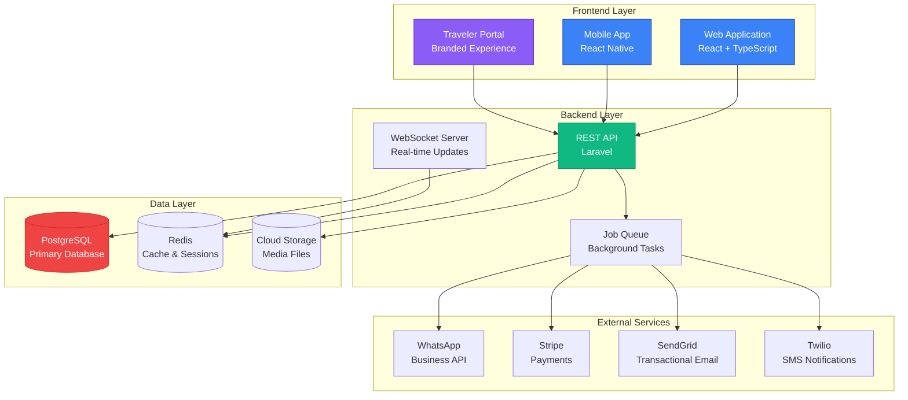

---

## 2. INFORMATION ARCHITECTURE

```mermaid
graph TD
    ROOT[Platform Root]
    
    ROOT --> AUTH[Authentication]
    ROOT --> ADMIN[Administrator]
    ROOT --> OPS[Operator]
    ROOT --> GUIDE[Guide]
    ROOT --> TRAVELER[Traveler]
    ROOT --> PARTNER[Partner]
    
    ADMIN --> DASH_A[Dashboard]
    ADMIN --> CRM[CRM Pipeline]
    ADMIN --> EXP_A[Expeditions]
    ADMIN --> OPS_A[Operations]
    ADMIN --> FIN[Financial]
    ADMIN --> CONTENT[Content Bank]
    ADMIN --> REPORTS[Analytics & Reports]
    ADMIN --> TEAM[Team Management]
    ADMIN --> SETTINGS[Settings]
    
    CRM --> LEADS[Leads List]
    CRM --> PIPELINE[Kanban Pipeline]
    CRM --> LEAD_DETAIL[Lead Detail]
    
    EXP_A --> EXP_LIST[Expeditions List]
    EXP_A --> EXP_CREATE[Create Expedition]
    EXP_A --> EXP_DETAIL[Expedition Detail]
    
    EXP_DETAIL --> EXP_OVERVIEW[Overview]
    EXP_DETAIL --> EXP_TRAVELERS[Travelers]
    EXP_DETAIL --> EXP_ITINERARY[Itinerary]
    EXP_DETAIL --> EXP_LOGISTICS[Logistics]
    EXP_DETAIL --> EXP_OPS[Operations]
    EXP_DETAIL --> EXP_FIN[Financial]
    
    OPS --> TASKS[My Tasks]
    OPS --> DASH_O[Operations Dashboard]
    
    GUIDE --> ACTIVE_EXP[Active Expedition]
    GUIDE --> UPCOMING[Upcoming]
    GUIDE --> HISTORY[Past Expeditions]
    
    TRAVELER --> DASH_T[My Expedition]
    TRAVELER --> ITINERARY_T[Itinerary]
    TRAVELER --> CHECKLIST[Pre-Departure Checklist]
    TRAVELER --> DOCS[Documents]
    TRAVELER --> GROUP[My Group]
    TRAVELER --> ALBUM[Photo Album]
    
    style ROOT fill:#8b5cf6,stroke:#6d28d9,color:#fff
    style ADMIN fill:#3b82f6,stroke:#1e40af,color:#fff
    style OPS fill:#10b981,stroke:#059669,color:#fff
    style GUIDE fill:#f59e0b,stroke:#d97706,color:#fff
    style TRAVELER fill:#ec4899,stroke:#db2777,color:#fff
    style PARTNER fill:#6366f1,stroke:#4f46e5,color:#fff
```

---

## 3. LEAD TO TRAVELER CONVERSION FLOW

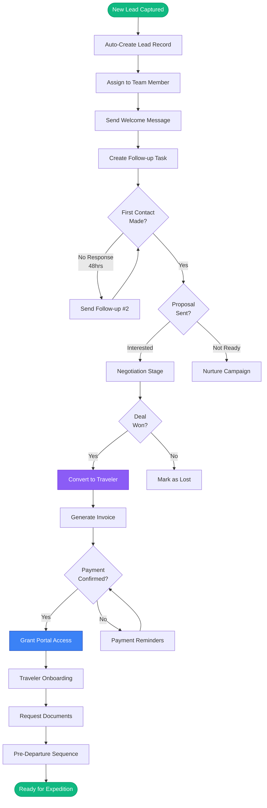

---

## 4. EXPEDITION LIFECYCLE

```mermaid
flowchart TB
    CREATE([Expedition Created]) --> SETUP[Setup Phase]
    
    SETUP --> CONFIG[Configure Details]
    CONFIG --> ITINERARY[Build Itinerary]
    ITINERARY --> LOGISTICS[Setup Logistics]
    LOGISTICS --> GUIDE_ASSIGN[Assign Guide]
    GUIDE_ASSIGN --> PUBLISH{Publish?}
    
    PUBLISH -->|Draft| DRAFT_STATE[Draft State]
    PUBLISH -->|Public| OPEN_BOOKINGS[Open for Bookings]
    
    DRAFT_STATE --> OPEN_BOOKINGS
    
    OPEN_BOOKINGS --> BOOKING_PHASE[Booking Phase]
    
    BOOKING_PHASE --> CHECK_CAP{Capacity<br/>Reached?}
    CHECK_CAP -->|No| BOOKING_PHASE
    CHECK_CAP -->|Yes| FULL[Fully Booked]
    
    FULL --> PRE_DEP[Pre-Departure Phase<br/>60-0 days]
    
    PRE_DEP --> D60[60 Days: Logistics Confirmation]
    D60 --> D30[30 Days: Send Travel Guide]
    D30 --> D14[14 Days: Create WhatsApp Group]
    D14 --> D7[7 Days: Final Details]
    D7 --> D1[1 Day: Final Checklist]
    
    D1 --> DEPARTURE([Departure Day])
    
    DEPARTURE --> ACTIVE[Active Expedition<br/>Daily Updates]
    
    ACTIVE --> CHECK_COMPLETE{Expedition<br/>Complete?}
    CHECK_COMPLETE -->|In Progress| ACTIVE
    CHECK_COMPLETE -->|Yes| RETURN([Return Day])
    
    RETURN --> POST[Post-Expedition Phase]
    
    POST --> P1[Day +1: Thank You Email]
    P1 --> P3[Day +3: Feedback Survey]
    P3 --> P7[Day +7: Send Photo Album]
    P7 --> P14[Day +14: Future Opportunities]
    P14 --> P30[Day +30: Archive & Analytics]
    
    P30 --> COMPLETE([Completed & Archived])
    
    style CREATE fill:#10b981,stroke:#059669,color:#fff
    style DEPARTURE fill:#f59e0b,stroke:#d97706,color:#fff
    style ACTIVE fill:#ef4444,stroke:#dc2626,color:#fff
    style RETURN fill:#f59e0b,stroke:#d97706,color:#fff
    style COMPLETE fill:#6366f1,stroke:#4f46e5,color:#fff
```

---

## 5. ADMINISTRATOR DAILY WORKFLOW

```mermaid
flowchart LR
    START([Start Day]) --> LOGIN[Login]
    LOGIN --> DASHBOARD[View Dashboard]
    
    DASHBOARD --> METRICS[Review Key Metrics]
    METRICS --> PIPELINE[Check CRM Pipeline]
    PIPELINE --> EXPEDITIONS[Review Expeditions]
    
    EXPEDITIONS --> CHECK_TASKS{Urgent<br/>Tasks?}
    
    CHECK_TASKS -->|Yes| HANDLE_TASKS[Handle Priority Tasks]
    HANDLE_TASKS --> CHECK_LEADS{New<br/>Leads?}
    
    CHECK_TASKS -->|No| CHECK_LEADS
    
    CHECK_LEADS -->|Yes| REVIEW_LEADS[Review & Assign]
    REVIEW_LEADS --> CHECK_PAYMENTS
    
    CHECK_LEADS -->|No| CHECK_PAYMENTS{Pending<br/>Payments?}
    
    CHECK_PAYMENTS -->|Yes| REVIEW_PAY[Review & Follow-up]
    REVIEW_PAY --> CHECK_OPS
    
    CHECK_PAYMENTS -->|No| CHECK_OPS{Operations<br/>Issues?}
    
    CHECK_OPS -->|Yes| RESOLVE[Resolve Issues]
    RESOLVE --> REPORTS
    
    CHECK_OPS -->|No| REPORTS[Review Reports]
    
    REPORTS --> STRATEGY[Strategic Planning]
    STRATEGY --> END([End Day])
    
    style START fill:#10b981,stroke:#059669,color:#fff
    style DASHBOARD fill:#3b82f6,stroke:#1e40af,color:#fff
    style END fill:#6366f1,stroke:#4f46e5,color:#fff
```

---

## 6. GUIDE EXPEDITION FLOW

```mermaid
flowchart TD
    ASSIGN([Assigned to Expedition]) --> PREP[Preparation Phase]
    
    PREP --> REVIEW[Review Expedition Details]
    REVIEW --> TRAVELERS[Study Traveler Profiles]
    TRAVELERS --> LOGISTICS[Review Logistics]
    LOGISTICS --> BRIEF[Attend Pre-Departure Briefing]
    
    BRIEF --> READY[Ready for Departure]
    
    READY --> DEP_DAY([Departure Day])
    
    DEP_DAY --> CHECKIN[Traveler Check-in]
    CHECKIN --> BRIEF_TRAVELERS[Brief Group]
    BRIEF_TRAVELERS --> START_EXP[Start Expedition]
    
    START_EXP --> DAILY[Daily Routine]
    
    DAILY --> MORNING[Morning Briefing]
    MORNING --> ACTIVITIES[Execute Activities]
    ACTIVITIES --> LOG[Log Daily Report]
    LOG --> PHOTOS[Upload Photos]
    PHOTOS --> EVENING[Evening Debrief]
    
    EVENING --> CHECK_ISSUES{Any<br/>Issues?}
    
    CHECK_ISSUES -->|Yes| REPORT_ISSUE[Report to HQ]
    REPORT_ISSUE --> RESOLVE_ISSUE[Resolve Issue]
    RESOLVE_ISSUE --> NEXT_DAY
    
    CHECK_ISSUES -->|No| NEXT_DAY{Last<br/>Day?}
    
    NEXT_DAY -->|No| DAILY
    NEXT_DAY -->|Yes| RETURN([Return Day])
    
    RETURN --> FINAL_CHECK[Final Check-out]
    FINAL_CHECK --> FAREWELL[Farewell to Group]
    FAREWELL --> FINAL_REPORT[Submit Final Report]
    FINAL_REPORT --> COMPLETE([Expedition Complete])
    
    style ASSIGN fill:#10b981,stroke:#059669,color:#fff
    style DEP_DAY fill:#f59e0b,stroke:#d97706,color:#fff
    style DAILY fill:#3b82f6,stroke:#1e40af,color:#fff
    style RETURN fill:#f59e0b,stroke:#d97706,color:#fff
    style COMPLETE fill:#6366f1,stroke:#4f46e5,color:#fff
```

---

## 7. TRAVELER JOURNEY

```mermaid
flowchart TB
    START([Interested in Expedition]) --> INQUIRY[Submit Inquiry]
    
    INQUIRY --> CONTACT[Receive Contact]
    CONTACT --> INFO[Receive Information]
    INFO --> DECIDE{Want to<br/>Book?}
    
    DECIDE -->|No| NURTURE[Stay on Nurture List]
    DECIDE -->|Yes| BOOK[Confirm Booking]
    
    BOOK --> INVOICE[Receive Invoice]
    INVOICE --> PAYMENT[Make Payment]
    
    PAYMENT --> CONFIRM[Booking Confirmed]
    CONFIRM --> PORTAL[Access Portal]
    
    PORTAL --> EXPLORE[Explore Expedition Details]
    EXPLORE --> DOCS[Upload Documents]
    DOCS --> CHECKLIST[Complete Checklist]
    CHECKLIST --> WAIT[Countdown to Departure]
    
    WAIT --> REMINDERS[Receive Reminders]
    REMINDERS --> GROUP[Join WhatsApp Group]
    GROUP --> FINAL_PREP[Final Preparations]
    
    FINAL_PREP --> DEPARTURE([Departure Day])
    
    DEPARTURE --> TRAVEL[Travel to Destination]
    TRAVEL --> EXPEDITION[Experience Expedition]
    
    EXPEDITION --> ENJOY[Daily Activities]
    ENJOY --> PHOTOS[Share Photos]
    PHOTOS --> NEXT_DAY{Last<br/>Day?}
    
    NEXT_DAY -->|No| ENJOY
    NEXT_DAY -->|Yes| RETURN([Return Home])
    
    RETURN --> THANKS[Receive Thank You]
    THANKS --> SURVEY[Complete Survey]
    SURVEY --> ALBUM[Receive Photo Album]
    ALBUM --> REVIEW[Leave Review]
    REVIEW --> SHARE[Share Experience]
    SHARE --> FUTURE[Future Expeditions?]
    
    FUTURE -->|Yes| START
    FUTURE -->|No| ALUMNI[Join Alumni Community]
    
    style START fill:#10b981,stroke:#059669,color:#fff
    style PORTAL fill:#8b5cf6,stroke:#6d28d9,color:#fff
    style DEPARTURE fill:#f59e0b,stroke:#d97706,color:#fff
    style EXPEDITION fill:#ec4899,stroke:#db2777,color:#fff
    style RETURN fill:#f59e0b,stroke:#d97706,color:#fff
    style ALUMNI fill:#6366f1,stroke:#4f46e5,color:#fff
```

---

## 8. PAYMENT PROCESSING FLOW

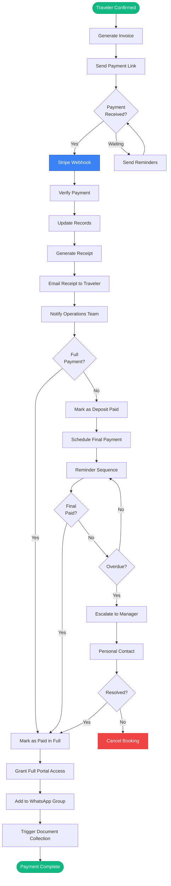

---

## 9. AUTOMATION TRIGGER MAP

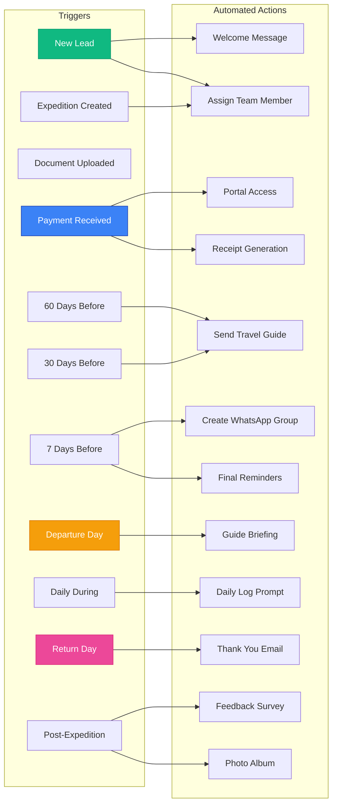

---

## 10. DATA FLOW ARCHITECTURE

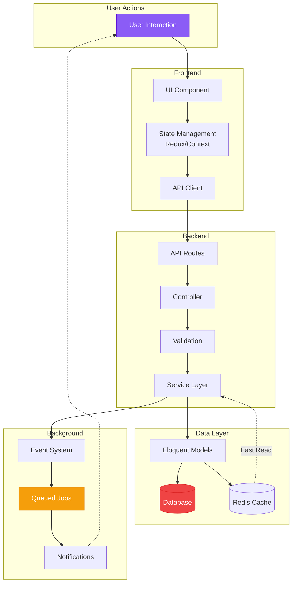

---

## 11. ROLE-BASED ACCESS CONTROL

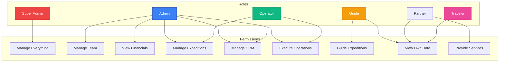

---

## 12. NOTIFICATION ROUTING

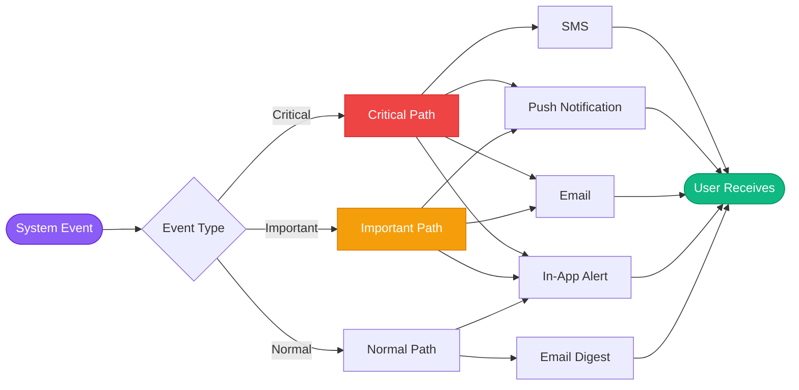

---

## 13. MOBILE APP NAVIGATION

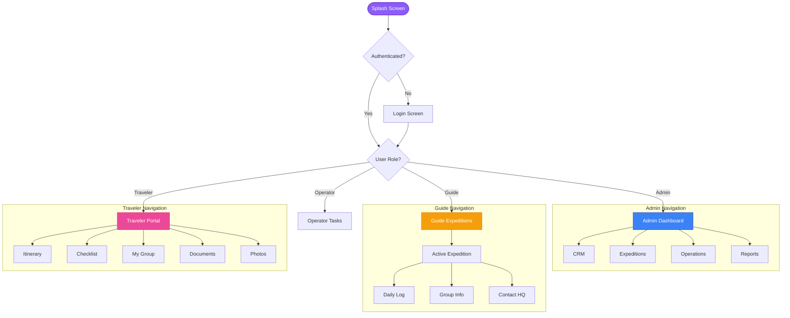

---

## 14. ERROR HANDLING FLOW

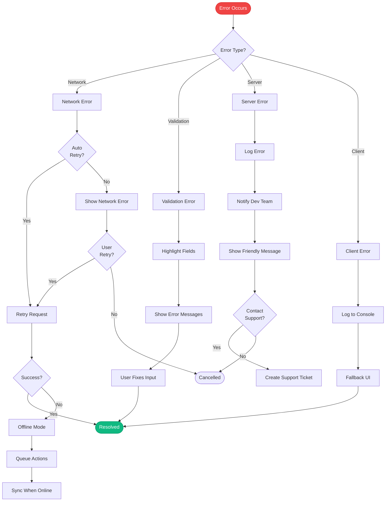

---

## 15. SEARCH & FILTER ARCHITECTURE

```mermaid
flowchart LR
    USER_INPUT[User Types Search] --> DEBOUNCE[Debounce 300ms]
    
    DEBOUNCE --> PARSE[Parse Query]
    PARSE --> BUILD[Build Search Criteria]
    
    BUILD --> CHECK_CACHE{In<br/>Cache?}
    
    CHECK_CACHE -->|Yes| RETURN_CACHE[Return Cached Results]
    CHECK_CACHE -->|No| SEARCH_DB[Search Database]
    
    SEARCH_DB --> ELASTICSEARCH{Use<br/>Elasticsearch?}
    
    ELASTICSEARCH -->|Yes| ES_SEARCH[Full-Text Search]
    ELASTICSEARCH -->|No| DB_SEARCH[SQL LIKE Query]
    
    ES_SEARCH --> RANK[Rank Results]
    DB_SEARCH --> RANK
    
    RANK --> FILTER[Apply Filters]
    FILTER --> PAGINATE[Paginate Results]
    PAGINATE --> CACHE[Cache Results]
    CACHE --> RETURN[Return to Frontend]
    
    RETURN_CACHE --> RETURN
    
    RETURN --> DISPLAY[Display Results]
    DISPLAY --> HIGHLIGHT[Highlight Matches]
    
    style USER_INPUT fill:#8b5cf6,stroke:#6d28d9,color:#fff
    style DISPLAY fill:#10b981,stroke:#059669,color:#fff
```

---

## VISUAL FLOW SUMMARY

✅ **15 Comprehensive Diagrams Created**

1. System Architecture Overview
2. Information Architecture
3. Lead to Traveler Conversion
4. Expedition Lifecycle
5. Administrator Daily Workflow
6. Guide Expedition Flow
7. Traveler Journey
8. Payment Processing
9. Automation Trigger Map
10. Data Flow Architecture
11. Role-Based Access Control
12. Notification Routing
13. Mobile App Navigation
14. Error Handling Flow
15. Search & Filter Architecture

These diagrams provide a complete visual understanding of:
- System structure
- User journeys
- Data flow
- Automation logic
- Navigation patterns
- Error handling
- Access control
- Process workflows

---

**Usage**: These Mermaid diagrams can be rendered in:
- GitHub/GitLab (native support)
- Documentation tools (Docusaurus, MkDocs)
- Notion, Confluence
- VS Code (with Mermaid preview extension)
- Online editors (mermaid.live)

They serve as living documentation that evolves with the platform.
